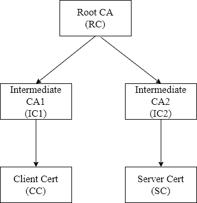

试验如何在客户端与服务端之间建立需双向身份验证的HTTPS/TLS连接。
## 试验工具与环境
- OS： 
  + Win10 x64: 运行Chrome
  + ArchLinux x64: 运行OpenSSL,NodeJS客户端,NodeJS服务端
- OpenSSL：1.1.1c
- Chrome：80.0.3987.132 
- NodeJS：10.16.3
## 证书关系结构


- Root CA(RC)是自签名根证书
- 由Root CA(RC)签发中间CA证书Intermediate CA1(IC1)与Intermediate CA2(IC2)
- 由IC1签发客户端证书Client Cert(CC)
- 由IC2签发服务端证书Server Cert(SC) 

> Note: 使用ECC算法（secp256k1等曲线）生成的公钥证书建立HTTPS/TLS连接有问题，这里使用RSA算法生成的证书进行试验。

- 生成Root CA证书RC:
  1. `openssl genrsa -out root_key.pem 2048`
  2. `openssl req -new -key root_key.pem -x509 -nodes -days 365 -subj "/CN=TestRoot/O=RepChain" -out root_cert.pem`
- 生成Intermediate CA1证书IC1: 
  1. `openssl genrsa -out ic1_key.pem 2048`
  2. `openssl req -new -key ic1_key.pem -nodes -subj "/CN=TestIntermediate1/O=RepChain" -out ic1_csr.pem`
  3. `echo basicConstraints=CA:TRUE > ca_v3.ext`
  4. `openssl x509 -req -extfile ca_v3.ext -days 365 -set_serial 01 -in ic1_csr.pem -CA root_cert.pem -CAkey root_key.pem -out ic1_cert.pem`
- 生成Intermediate CA2证书IC2: 
  1. `openssl genrsa -out ic2_key.pem 2048`
  2. `openssl req -new -key ic2_key.pem -nodes -subj "/CN=TestIntermediate2/O=RepChain" -out ic2_csr.pem`
  3. `openssl x509 -req -extfile ca_v3.ext -days 365 -set_serial 02 -in ic2_csr.pem -CA root_cert.pem -CAkey root_key.pem -out ic2_cert.pem`
- 生成Client证书CC: 
  1. `openssl genrsa -out cc_key.pem 2048`
  2. `openssl req -new -key cc_key.pem -nodes -subj "/CN=TestClient/O=RepChain" -out cc_csr.pem `
  3. `openssl x509 -req -days 365 -set_serial 01 -in cc_csr.pem -CA ic1_cert.pem -CAkey ic1_key.pem -out cc_cert.pem`
  4. `openssl pkcs12 -export -in cc_cert.pem -inkey cc_key.pem -out cc.p12`
- 生成Server证书SC: 
  1. `openssl genrsa -out sc_key.pem 2048`
  2. `openssl req -new -key sc_key.pem -nodes -subj "/CN=localhost/O=RepChain" -out sc_csr.pem `
  3. `echo subjectAltName=DNS:localhost > end_v3.ext`
  4. `openssl x509 -req -extfile end_v3.ext -days 365 -set_serial 01 -in sc_csr.pem -CA ic2_cert.pem -CAkey ic2_key.pem -out sc_cert.pem`

## HTTPS服务端
使用NodeJS自带的HTTPS库创建HTTPS服务:
```javascript
import https from "https";

......

const options = {
    cert: fs.readFileSync(path.join(cryptoMaterialDir, "sc_cert.pem")), // 服务端证书
    key: fs.readFileSync(path.join(cryptoMaterialDir, "sc_key.pem")), // 服务端证书对应私钥
    requestCert: true, // 要求客户端提供客户端证书
    rejectUnauthorized: false, // 客户端证书无效时也不拒绝连接
    ca: [
        fs.readFileSync(path.join(cryptoMaterialDir, "root_cert.pem")),
        fs.readFileSync(path.join(cryptoMaterialDir, "ic1_cert.pem")),
    ],
, // 用于验证客户端证书的CA证书(自动构建证书链)
};

.......

// 可以获取到客户端证书信息
const clientCert = req.connection.getPeerCertificate();

.......

https.createServer(options, app)
    .listen(8888)
    .on("clientError", (err) => console.error("ConnectionError:", err));
```
开启服务端：
```bash
yarn install
yarn start:server
```

## 客户端
使用浏览器和NodeJS程序分别作为客户端来进行连接验证。
### 浏览器
使用Chrome浏览器作为客户端
- 在浏览器地址栏输入https://localhost:8888 此时页面显示连接不安全，无法验证服务端证书。
- 导入前面生成的Root CA证书root\_cert.pem，以及签发服务端证书的Intermediate CA2证书ic2\_cert.pem。进入浏览器菜单进行操作：设置->高级->证书管理。
- 导入成功后，在浏览器地址栏输入https://localhost:8888 此时已能验证服务端证书，页面信息提示需要导入客户端证书。
- 导入前面生成的Client证书cc.p12，该证书文件包含了客户端的私钥和X.509证书。
- 导入成功后，在浏览器地址栏输入https://localhost:8888 此时弹出选择框，选择使用的客户端证书，然后页面信息显示通过证书身份验证，并能返回客户端证书详细信息。

### NodeJS客户端
```javascript
import https from "https";

......

const options = {
    hostname: "localhost",
    port: "8888",
    method: "get",
    pfx: fs.readFileSync(path.join(cryptoMaterialDir, "cc.p12")), // 客户端证书(包含私钥)
    ca: [
        fs.readFileSync(path.join(cryptoMaterialDir, "ic2_cert.pem")),
        fs.readFileSync(path.join(cryptoMaterialDir, "root_cert.pem")),
    ], // 用于验证服务端证书的CA证书(自动构建证书链)
    agent: false,
};

const req = https.request(options, (res) => {
    res.on("data", (d) => {
        console.log(d.toString());
    });
})

......

```
运行客户端程序
```javascript
yarn start:client
```
返回信息显示连接成功并通过身份验证。

## 总结
双向身份验证的HTTPS/TLS连接的建立，需要客户端与服务端能够验证对方的数字证书，因此各自需要能够验证对方身份证书的证书路径。

基于椭圆曲线加密算法ECC中某些曲线(如secp256k1)的公钥证书在本试验环境中无法建立HTTPS/TLS连接，具体原因未知。

在本试验环境下，客户端与服务端可以成功建立基于双向身份验证的HTTPS/TSL连接，并且服务端处理逻辑可以获取到客户端的证书信息。